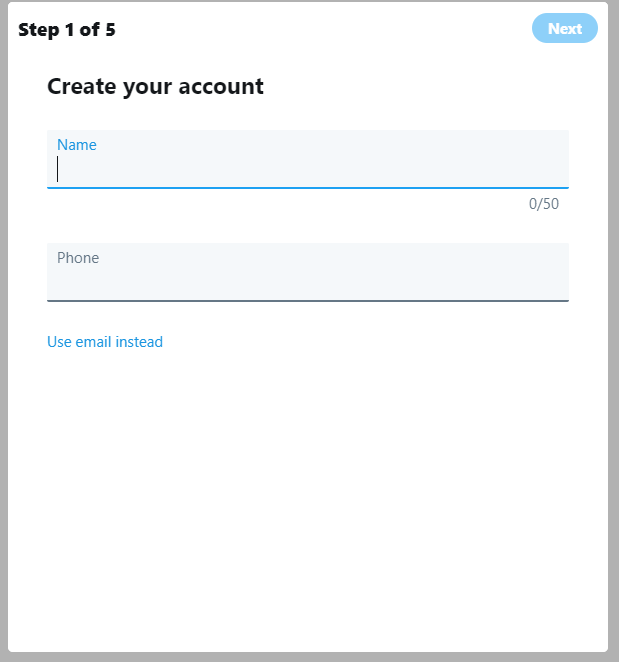
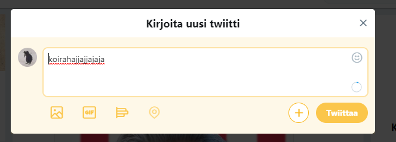

# Twitter

Twitter on amerikkalainen online uutis- ja sosiaalinen verkostoitumispalvelu.

Twitteriin voi postata melkein mitä vaan, mutta rekisteröitymätön käyttäjä voi vain lukea muiden postauksia.

Twitteriä voi käyttää nettisivun kautta, aplikaation kautta ja tekstiviestisovelluksen kautta.

Viestien merkkiraja on 240, ennen se oli 140.

[Twitterin osoite](https://twitter.com/)

Käyttöohje/tutoriaali
1. tee käyttäjätunnus

2. paina nappulaa, josta tehdään twiitti

    

3. kirjoita twiittiin jotakin

4. postaa
5. profit

